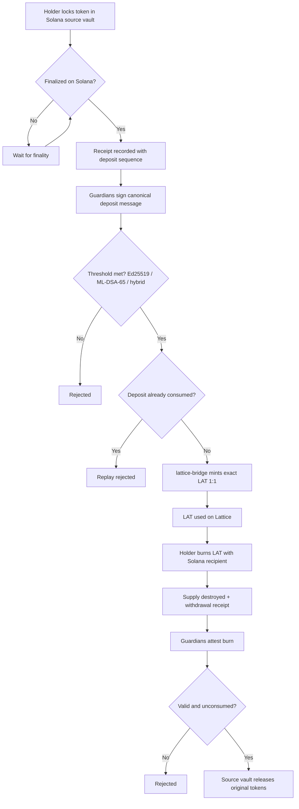
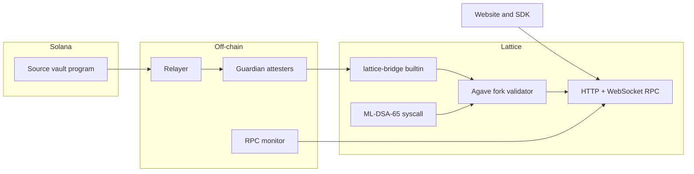

# Lattice

**Solana, built for quantum.** Lattice is a Solana-derived network (a fork of Agave v4.3.0) that adds NIST ML-DSA post-quantum signatures, verified by the chain itself, and a native coin, LAT, designed to redeem 1:1 for its source token on Solana.

The network code lives in [`network/`](network/). The existing web app at the repository root is unchanged.

## Status

| Component | Status |
| --- | --- |
| Lattice devnet: validator, RPC, WebSocket, explorer, faucet | Live (local development) |
| Website: live RPC vitals, peg charts, bridge UI, docs | Live (local development) |
| Development bridge: deposit, issue, burn, redeem with test assets | Live (local development) |
| ML-DSA-65 verification syscall and `pq-vault` program | Implemented and tested |
| Native LAT issuance and burn (`lattice-bridge` builtin) | Implemented and tested |
| Solana source vault and guardian relayer | Implemented and tested |
| Public testnet on AWS | Deploying |
| Mainnet with real tokens | After external security review, starting with a deposit cap |

## How it works





Backing invariant: reserves in the vault must cover everything owed, `R >= N + P + W` (native supply plus pending deposits plus pending withdrawals). Reserves and liabilities are published from on-chain data.

## Run locally

```sh
cd network
corepack enable && pnpm install
./chain/scripts/start-local.sh --reset   # Lattice devnet on :8899 / :8900
pnpm build && pnpm --filter @lattice/web start
```

Open http://localhost:3000. Read the specification in [`network/docs/BRIDGE_SPEC.md`](network/docs/BRIDGE_SPEC.md), the post-quantum scope in [`network/docs/QUANTUM.md`](network/docs/QUANTUM.md), and the deployment runbook in [`network/infra/RUNBOOK.md`](network/infra/RUNBOOK.md).

## Security

Post-quantum protection currently covers runtime-verified ML-DSA authorization. Fee payers, validator identity, consensus and networking still use Ed25519. The source token on Solana remains as secure as Solana. The bridge code is unaudited; no real funds until review.
